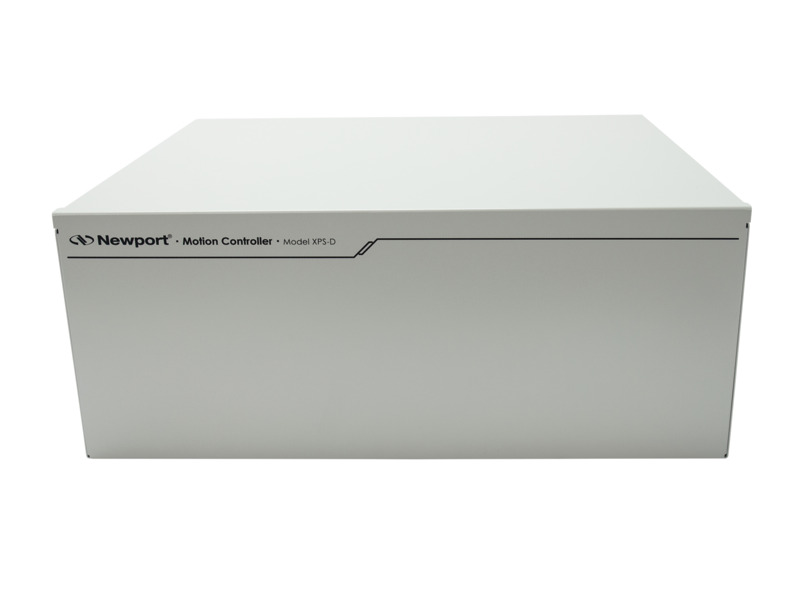

==================
Supported Hardware
==================

Motion Controllers
==================

Below is a list of motion controllers and tested stage supported by Lab-Control-Lib

+---------------------+--------------------+------------------------------+----------------+-----------------------+------------------------+-------------------------+
|  **Controller**     |    **Image**       |   **Stage**                  |    **Image**   |      **Interface**    |      **Developer**     |     **Status**          |
+---------------------+--------------------+------------------------------+----------------+-----------------------+------------------------+-------------------------+
|  Newport XPS        |     |00001|        |   Newport MFA-CC             |     |00002|    |      SUB-D25M         |     `Pierre Thibault`_ |    fully tested         |
+---------------------+--------------------+------------------------------+----------------+-----------------------+------------------------+-------------------------+
|  Smaract            |     |00003|        |   three-axis piezo (x,y,z)   |     |00004|    |   ASCII over IP/TCP   |     `Pierre Thibault`_ |    fully tested         |
+---------------------+--------------------+------------------------------+----------------+-----------------------+------------------------+-------------------------+

.. _Pierre Thibault: pthibault@units.it

Detectors
=========
